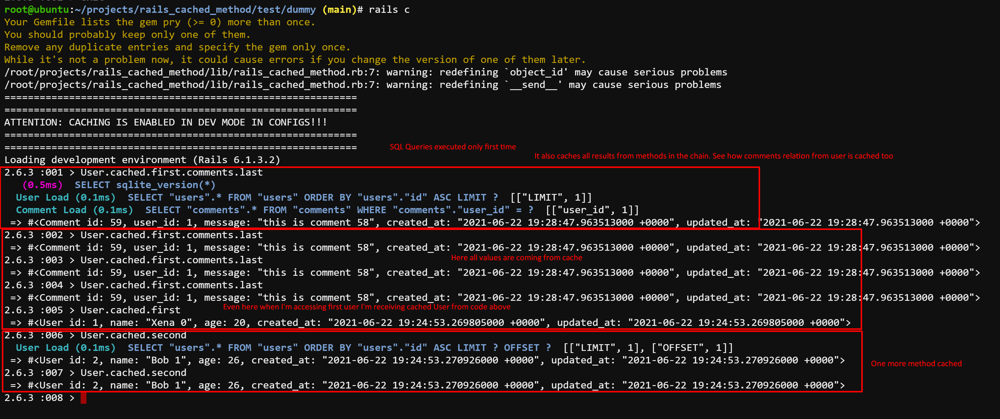

# Rails Cached Method

Simple way to cache results of methods. Using `Rails.cache` inside with default expiration time of 1 minute.



## Usage

To get a value and cache it just write a code like:

```ruby
User.cached.admins # get list of admins and automatically put them in cache with 1 minute TTL
post.cached.comments.last # get last comment from the post and cache it
User.cached.where(role: :moderator).count # cache moderators count
Project.cached.first.some_heavey_method # cache result of some_heavey_method for first Project (if first is Project.first)
```

So basically just call method `cached` on any object. It will wrap and cache **every** result from the next method call. So every result from method chain is cached.

For example:

```ruby
post.cached.comments.first # A
post.cached.comments.last  # B
```

Here `post.cached.comments` will return same collection.

You don't need to specify a key, because it's dynamically set based on object, arguments, etc.

Options:

```ruby
cached(key: nil, expires_in: 1.minute, recache: false)
```

key - you can set your key.
expires_in - TTL of cached object.
recache - should be key deleted and cached again.

## Tips & Tricks

1) use `if page.present?` to check if value is really present. Because every value is wrapped in a class if statement can work incorrectly
```ruby
    page = Page.cached.find_by(identifier: identifier)
    return page if page # change to return page if page.present?
    page = Page.new(identifier: identifier, title: identifier)
    page.save(validate: false)
    page
```    
    


## How it works

After you call `.cached` it will generate a cache key and store value in Rails.cache. Value is class which is wrapps original value and allow you to call methods on the value using `method_missing`. Every result is cached again and again. So on every method call in methods chain every result will be stored in Rails.cache.

To get original value you can call `.__value__`.

Some pieces of code to show you how it works:

```ruby
    def cached(key: nil, expires_in: 1.minute, recache: false)
      CachedProxy.new(
        self,
        key: key,
        expires_in: expires_in,
        recache: recache
      )
    end
# ---------------------------------------------------------------
    class CachedProxy

    Object.methods.each do |e|
      delegate e, to: :@__object__
    end
    
    def method_missing(*args)
      key = ___compose_key__(args)
      if @__recache__
        Rails.cache.delete(key)
      end
      Rails.cache.fetch(key, expires_in: @__expires_in__) do
        CachedProxy.new(
          @__object__.send(*args),
          expires_in: @__expires_in__,
          recache: @__recache__,
          parent_key: key,
        )
      end
    end    
    private
    def ___compose_key__(args)
      result = [@__parent_key__, @__key__]
      result += if @__object__.respond_to?(:to_global_id)
        [@__object__.to_global_id]
      elsif @__object__.is_a?(ActiveRecord::Relation)
        [@__object__.class]
      else
        [@__object__]
      end
      result += args[0..1]
      result.compact.map(&:to_s).join('.').dasherize
    end
```    

## Installation
Add this line to your application's Gemfile:

```ruby
gem 'rails_cached_method'
```

And then execute:
```bash
$ bundle
```

Or install it yourself as:
```bash
$ gem install rails_cached_method
```

## TODO

- think if rails dependency could be replaced with something more lightweight

## Contributing
Contribution directions go here.

## License
The gem is available as open source under the terms of the [MIT License](https://opensource.org/licenses/MIT).
